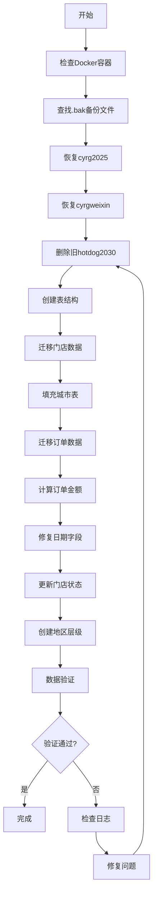

# 数据库完整初始化指南

## 📋 概述

本指南提供了从数据库备份文件到完整系统初始化的自动化流程，避免反复手动调试。

---

## 🎯 设计理念

### 数据流架构

```
定期数据库备份
  ↓
.bak备份文件
  ↓
恢复到cyrg2025 + cyrgweixin（源数据库）
  ↓
数据清洗和转换
  ↓
生成hotdog2030（分析数据库）
  ↓
业务系统使用
```

### 数据库分工

1. **cyrg2025**（源数据库 - 只读）
   - 作用：保存业务系统原始数据
   - 来源：定期从生产环境导出的.bak文件
   - 表：Shop, Orders, OrderGoods, Goods, XcxUser, CardVip等
   - 特点：保持原始结构，不做修改

2. **cyrgweixin**（源数据库 - 只读）
   - 作用：保存微信相关数据
   - 来源：定期从生产环境导出的.bak文件
   - 表：微信用户、公众号数据等
   - 特点：辅助数据源

3. **hotdog2030**（分析数据库 - 读写）
   - 作用：数据分析、可视化、新功能开发
   - 来源：从cyrg2025和cyrgweixin清洗转换而来
   - 表：
     - 核心业务表：stores, orders, order_items, products, customer_profiles
     - 辅助表：city, region_hierarchy
     - 新功能表：site_selection_data（选址）, sales_predictions（销售预测）
   - 特点：优化结构，添加索引，支持新功能

---

## 🚀 快速开始

### 前提条件

1. **Docker已安装并运行**
   ```bash
   docker --version
   docker ps | grep sqlserver
   ```

2. **Python环境**
   ```bash
   python3 --version
   pip3 install pyodbc
   ```

3. **备份文件准备**
   - 将最新的.bak文件放入`database/`目录
   - cyrg2025备份：`database/cyrg_backup_YYYYMMDD_*.bak`
   - cyrgweixin备份：`database/zhkj_backup_YYYYMMDD_*.bak`

### 一键初始化

```bash
# 确保脚本可执行
chmod +x restore-and-init-complete.sh

# 执行完整初始化
./restore-and-init-complete.sh
```

---

## 📖 详细步骤说明

### 步骤1: 验证源数据库

**检查项**：
- cyrg2025数据库是否可访问
- cyrgweixin数据库是否可访问
- 各数据库的表数量

**如果失败**：
- 检查备份文件是否存在
- 检查备份文件是否完整
- 检查SQL Server容器是否正常运行

### 步骤2: 初始化hotdog2030结构

**操作**：
- 删除旧的hotdog2030数据库（如存在）
- 创建新的hotdog2030数据库
- 创建所有表结构

**创建的表**：
1. `city` - 城市信息表
2. `region_hierarchy` - 地区层级表
3. `stores` - 门店表
4. `orders` - 订单表（包含所有支付字段）
5. `order_items` - 订单商品明细表
6. `products` - 商品表
7. `customer_profiles` - 客户档案表
8. `site_selection_data` - 选址数据表

**关键设计**：
- `orders.created_at`：不使用默认值GETDATE()，从`order_date`复制（避免日期错误）
- `orders`包含详细支付字段：`cash`, `vip_amount`, `card_amount`等
- 所有表都有`delflag`软删除标记
- 创建必要的索引提升查询性能

### 步骤3: 迁移门店数据

**源表**：`cyrg2025.Shop`

**转换逻辑**：
- `Id` → `stores.id` (保持原值)
- `Id` → `stores.store_code` (用于映射)
- `ShopName` → `stores.store_name`
- `city` → `stores.city`
- 自动推断`province`：
  - 沈阳市/辽阳市 → 辽宁省
  - 滨州市 → 山东省
  - 仙桃市 → 湖北省
- `IsSelf` → `stores.is_self` (1=直营店, 0=加盟店)

**结果**：22个门店，分布在3个省4个城市

### 步骤4: 填充城市表

**操作**：
- 从`stores`表中提取所有唯一城市
- 自动关联省份
- 插入到`city`表

**结果**：
- 沈阳市（辽宁省）
- 辽阳市（辽宁省）
- 滨州市（山东省）
- 仙桃市（湖北省）

### 步骤5: 迁移订单数据

**源表**：`cyrg2025.Orders`

**关键转换**：
1. **门店ID映射**：
   - `shopId`（原始ID）→ `stores.id`（新ID）
   - 通过`store_code`建立映射关系

2. **日期字段**：
   - `recordTime` → `order_date`
   - `order_date` → `created_at`（关键！确保统计准确）

3. **金额计算**（根据payMode）：
   ```
   IF payMode = '小程序' OR '收银机':
       优先使用orderValue
       否则使用cash + vip_amount + card_amount
   ELSE IF payMode = '会员充值':
       使用vipAmount
   ELSE IF payMode = '充值卡':
       使用cardAmount
   ```

4. **支付字段**：
   - `cash`, `vipAmount`, `cardAmount` 等全部迁移
   - 用于详细金额展示

**结果**：154,542笔订单，日期分布正常

### 步骤6: 更新门店状态

**逻辑**：
- 有订单的门店 → 状态设为"营业中"
- 无订单的门店 → 保持原状态

**结果**：21个门店设为营业中，1个门店待开业

### 步骤7: 创建地区层级

**操作**：
- 基于实际门店分布创建省-市两级层级
- 生成唯一编码：`PROV_001`, `CITY_001`等
- 建立父子关系

**用途**：
- 级联选择器
- 地区统计分析
- 区域对比

### 步骤8: 数据验证

**验证项**：
- 城市数量
- 门店数量
- 订单数量
- 各城市数据分布
- 订单日期分布

**输出示例**：
```
城市           门店数    订单数         总销售额
沈阳市         19        148,655        ¥2,015,836.61
辽阳市         1         3,861          ¥55,364.15
仙桃市         1         2,426          ¥32,654.00
滨州市         1         0              ¥0.00
```

---

## 🔧 脚本使用说明

### 自动化脚本

#### `restore-and-init-complete.sh`

**功能**：
- 自动查找最新的.bak备份文件
- 恢复cyrg2025和cyrgweixin数据库
- 调用Python脚本初始化hotdog2030
- 完整的错误处理和日志输出

**使用方法**：
```bash
./restore-and-init-complete.sh
```

**日志文件**：
- 脚本执行日志：终端输出
- Python初始化日志：`init_hotdog2030_YYYYMMDD_HHMMSS.log`

#### `init-hotdog2030-complete-v2.py`

**功能**：
- 独立的hotdog2030初始化Python脚本
- 包含所有数据清洗和修复逻辑
- 详细的步骤日志

**使用方法**：
```bash
python3 init-hotdog2030-complete-v2.py
```

### 手动执行（分步调试）

如果需要单独执行某个步骤：

```python
# 导入脚本
from init_hotdog2030_complete_v2 import *

# 获取连接
conn = get_connection()

# 执行特定步骤
step3_migrate_stores(conn)
```

---

## 🗂️ 目录结构

```
yylkhotdog/
├── database/
│   ├── cyrg_backup_2025_10_11_170100.bak      # cyrg2025最新备份
│   ├── zhkj_backup_2025_10_11_165900.bak      # cyrgweixin最新备份
│   ├── 纯佑热狗主要数据表(1)(1).xlsx           # 字段说明文档
│   └── 热狗巡店表(1).xlsx                      # 巡店表说明文档
├── restore-and-init-complete.sh               # 一键初始化脚本
├── init-hotdog2030-complete-v2.py             # Python初始化脚本
├── DATABASE_INIT_COMPLETE_GUIDE.md            # 本文档
└── init_hotdog2030_*.log                      # 执行日志
```

---

## ⚙️ 配置说明

### 数据库连接配置

在`init-hotdog2030-complete-v2.py`中：

```python
SERVER = "localhost,1433"
USERNAME = "sa"
PASSWORD = "YourStrong@Passw0rd"
DRIVER = "ODBC Driver 18 for SQL Server"
```

### 备份文件命名规范

- cyrg2025备份：`cyrg_backup_YYYYMMDD_*.bak`
- cyrgweixin备份：`zhkj_backup_YYYYMMDD_*.bak`

脚本会自动查找最新的备份文件（按修改时间）。

---

## 🔍 故障排除

### 问题1: 找不到备份文件

**错误信息**：
```
❌ 未找到cyrg2025备份文件
```

**解决方法**：
1. 检查`database/`目录下是否有.bak文件
2. 确认文件名符合命名规范
3. 检查文件权限

### 问题2: 数据库恢复失败

**错误信息**：
```
❌ cyrg2025数据库恢复失败
```

**解决方法**：
1. 检查Docker容器是否运行
2. 检查SA密码是否正确
3. 查看SQL Server日志：
   ```bash
   docker logs yylkhotdog-sqlserver-1
   ```
4. 尝试手动恢复：
   ```bash
   docker exec -it yylkhotdog-sqlserver-1 /opt/mssql-tools18/bin/sqlcmd \
       -S localhost -U sa -P "YourStrong@Passw0rd" -C
   ```

### 问题3: 门店ID映射失败

**症状**：订单数量为0，但源数据库有订单

**原因**：门店ID映射关系错误

**验证**：
```sql
-- 检查映射关系
SELECT 
    s.id as new_id, 
    s.store_code as original_id, 
    s.store_name
FROM hotdog2030.dbo.stores s
WHERE s.store_code IN ('30', '42', '47');
```

**解决**：重新执行初始化脚本

### 问题4: 日期显示不正确

**症状**：所有订单显示为今天

**原因**：`created_at`使用了GETDATE()默认值

**解决**：
- 新版脚本中`created_at`直接使用`order_date`值
- 不使用DEFAULT GETDATE()
- 重新执行初始化即可

### 问题5: 城市数据不全

**症状**：只显示沈阳市

**原因**：city表未填充其他城市

**解决**：
- 步骤4会自动从stores表提取所有城市
- 确保该步骤成功执行
- 验证：`SELECT * FROM hotdog2030.dbo.city`

---

## 📊 数据验证清单

### 初始化后必须验证的数据

#### 1. 城市数据
```sql
SELECT city_name, province, COUNT(*) as count
FROM hotdog2030.dbo.city
WHERE delflag = 0
GROUP BY city_name, province;
```

**期望结果**：4个城市（沈阳、辽阳、仙桃、滨州）

#### 2. 门店数据
```sql
SELECT city, COUNT(*) as store_count
FROM hotdog2030.dbo.stores
WHERE delflag = 0
GROUP BY city;
```

**期望结果**：
- 沈阳市：19个
- 其他城市：各1个

#### 3. 订单日期分布
```sql
SELECT TOP 10
    CAST(created_at AS DATE) as order_date,
    COUNT(*) as order_count
FROM hotdog2030.dbo.orders
WHERE delflag = 0
GROUP BY CAST(created_at AS DATE)
ORDER BY order_count DESC;
```

**期望结果**：
- 日期分布正常（不是全部集中在同一天）
- 每日订单数在1000-1500之间

#### 4. 订单金额准确性
```sql
SELECT 
    pay_mode,
    COUNT(*) as order_count,
    AVG(total_amount) as avg_amount,
    SUM(total_amount) as total_sales
FROM hotdog2030.dbo.orders
WHERE delflag = 0 AND pay_state = 2
GROUP BY pay_mode;
```

**期望结果**：
- 各支付方式的金额合理
- 无大量0金额订单
- 客单价在10-20元之间

#### 5. 门店-订单关联
```sql
SELECT 
    s.store_name,
    s.city,
    COUNT(o.id) as order_count,
    SUM(CASE WHEN o.pay_state = 2 THEN o.total_amount ELSE 0 END) as revenue
FROM hotdog2030.dbo.stores s
LEFT JOIN hotdog2030.dbo.orders o ON s.id = o.store_id AND o.delflag = 0
WHERE s.delflag = 0
GROUP BY s.store_name, s.city
ORDER BY order_count DESC;
```

**期望结果**：
- 沈阳一二六中学店：最多订单
- 辽阳宏伟实验学校店：3861笔
- 仙桃第一中学店：2426笔

---

## 🔄 定期更新流程

### 每周/每月数据更新

1. **获取最新备份**
   ```bash
   # 从生产环境导出最新.bak文件
   # 复制到database/目录
   cp /path/to/cyrg_backup_*.bak database/
   cp /path/to/zhkj_backup_*.bak database/
   ```

2. **执行初始化**
   ```bash
   ./restore-and-init-complete.sh
   ```

3. **验证数据**
   - 检查订单日期范围
   - 验证新增订单数量
   - 确认数据完整性

4. **重启服务**
   ```bash
   cd backend && npm run dev &
   cd frontend && npm start &
   ```

### 备份文件管理建议

```bash
database/
├── archive/                    # 历史备份归档
│   ├── 2025-09/
│   │   ├── cyrg_backup_2025_09_09_*.bak
│   │   └── zhkj_backup_2025_09_09_*.bak
│   └── 2025-10/
│       ├── cyrg_backup_2025_10_11_*.bak
│       └── zhkj_backup_2025_10_11_*.bak
└── cyrg_backup_latest.bak      # 最新备份（符号链接）
```

---

## 🎨 扩展功能开发

### 添加新表到hotdog2030

在`init-hotdog2030-complete-v2.py`的`step2_init_hotdog2030_structure`函数中添加：

```python
-- 9. 新功能表
CREATE TABLE your_new_table (
    id BIGINT IDENTITY(1,1) PRIMARY KEY,
    -- 你的字段
    created_at DATETIME2 DEFAULT GETDATE(),
    updated_at DATETIME2 DEFAULT GETDATE(),
    delflag BIT DEFAULT 0
);
```

### 添加数据迁移逻辑

创建新的step函数：

```python
def step9_migrate_your_data(conn):
    """步骤9: 迁移你的新数据"""
    logger.info("=" * 80)
    logger.info("步骤9: 迁移新数据")
    logger.info("=" * 80)
    
    cursor = conn.cursor()
    # 你的迁移逻辑
    return True
```

然后在`main()`函数的`steps`列表中添加：

```python
steps = [
    # ... 现有步骤
    ("迁移新数据", step9_migrate_your_data),
]
```

---

## 📝 重要注意事项

### DO's ✅

1. **定期备份**：每周至少备份一次生产数据库
2. **版本管理**：保留历史备份文件，至少保留最近3个版本
3. **日志检查**：每次初始化后检查日志文件
4. **数据验证**：执行完整的验证SQL确认数据正确
5. **测试环境**：先在测试环境验证，再应用到生产

### DON'Ts ❌

1. **不要**直接修改源数据库（cyrg2025, cyrgweixin）
2. **不要**手动修改hotdog2030结构（通过脚本管理）
3. **不要**跳过数据验证步骤
4. **不要**删除日志文件（用于问题排查）
5. **不要**在生产环境直接测试新功能

---

## 🚦 执行流程图



---

## 📈 性能优化

### 大数据量处理

如果订单数超过100万：

1. **批量插入**：
   ```python
   # 使用executemany()替代单条插入
   cursor.executemany(insert_sql, batch_data)
   ```

2. **分批提交**：
   ```python
   for i in range(0, len(orders), 10000):
       batch = orders[i:i+10000]
       # 处理批次
       conn.commit()
   ```

3. **禁用索引**：
   ```sql
   -- 迁移前禁用索引
   ALTER INDEX ALL ON orders DISABLE;
   -- 迁移数据
   -- 迁移后重建索引
   ALTER INDEX ALL ON orders REBUILD;
   ```

### 索引策略

```sql
-- 复合索引（常用查询组合）
CREATE INDEX idx_orders_store_date 
ON orders(store_id, created_at, pay_state);

CREATE INDEX idx_orders_customer_date 
ON orders(customer_id, created_at);

-- 包含列索引（避免回表）
CREATE INDEX idx_orders_stats 
ON orders(store_id, pay_state, created_at)
INCLUDE (total_amount, customer_id);
```

---

## 🎯 未来扩展规划

### 1. 自动化选址功能

**新表**：`site_selection_data`

**数据来源**：
- 人口数据API
- 地图POI数据
- 竞品门店信息
- 租金数据

**集成方式**：
在初始化脚本中添加`step_import_site_selection_data()`

### 2. 销售预测优化

**需求**：
- 存储历史预测结果
- 对比预测准确度
- 优化预测算法

**实现**：
- 添加`sales_predictions`表
- 记录每次预测的结果
- 定期评估准确度

### 3. 客户画像增强

**需求**：
- RFM模型
- 客户分群
- 消费习惯分析

**实现**：
- 在`customer_profiles`表中添加更多字段
- 定期更新客户标签
- 支持个性化推荐

---

## 📞 技术支持

### 常见问题

**Q: 初始化要多久？**  
A: 通常5-10分钟，取决于数据量和硬件性能。

**Q: 可以中断后继续吗？**  
A: 不建议。建议重新执行完整流程。

**Q: 如何回滚？**  
A: 删除hotdog2030数据库，重新执行脚本即可。

**Q: 生产环境如何部署？**  
A: 修改脚本中的SERVER和连接参数，确保网络可达。

### 联系方式

- 文档问题：查看`DATABASE_INIT_COMPLETE_GUIDE.md`
- 数据问题：查看执行日志`init_hotdog2030_*.log`
- 功能问题：查看`DATA_DRILL_DOWN_GUIDE.md`

---

## ✨ 更新日志

### v2.0 (2025-10-12)
- ✅ 修复订单日期字段问题（created_at不再使用GETDATE()）
- ✅ 完善多城市数据支持（自动提取和关联省份）
- ✅ 增强订单金额计算逻辑（基于payMode）
- ✅ 添加所有支付详细字段
- ✅ 完善数据验证步骤
- ✅ 添加完整的日志系统

### v1.0 (2025-09-XX)
- 基础数据迁移功能
- 简单的表结构创建

---

**最后更新**: 2025-10-12  
**适用版本**: hotdog2030 v2.0

